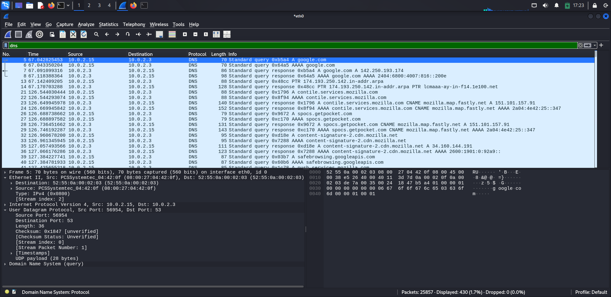
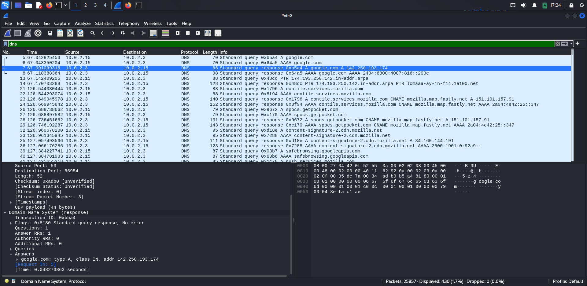
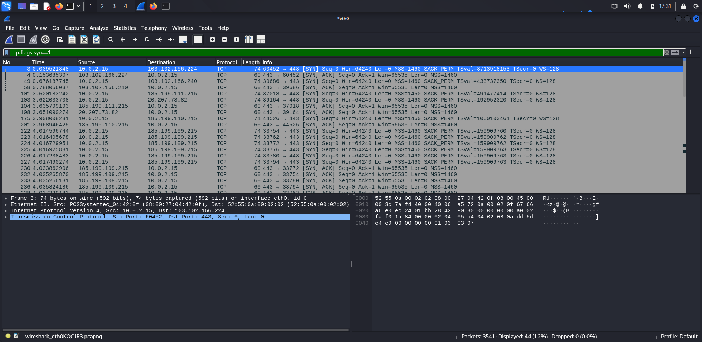
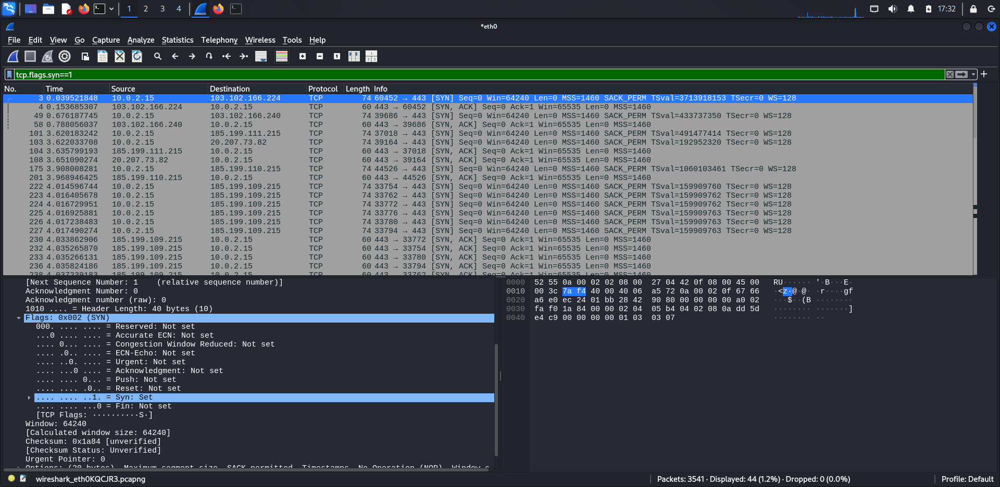
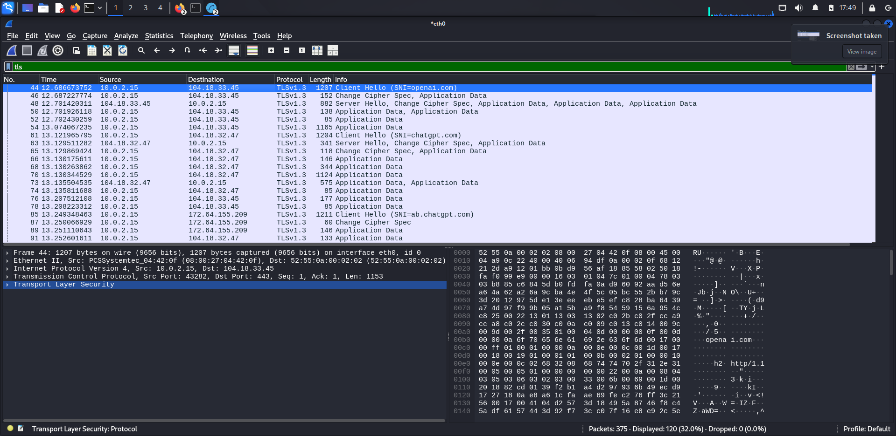
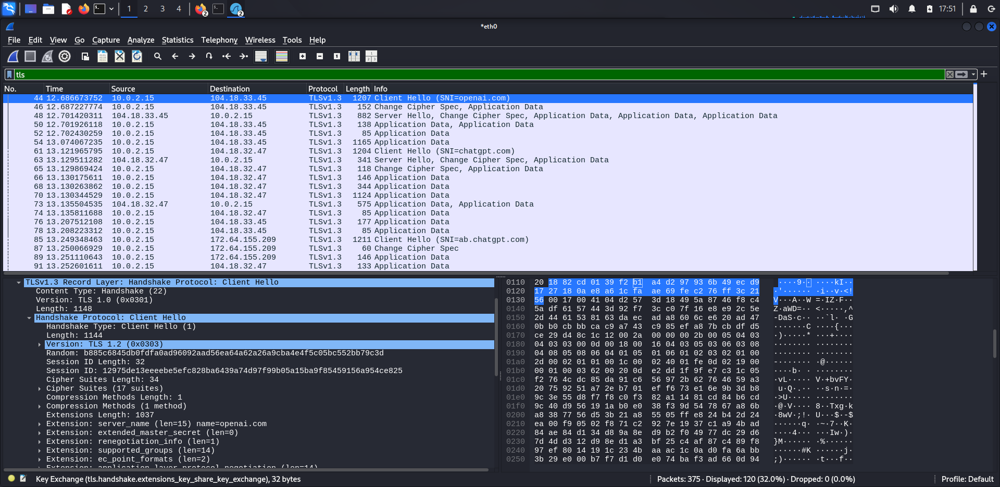
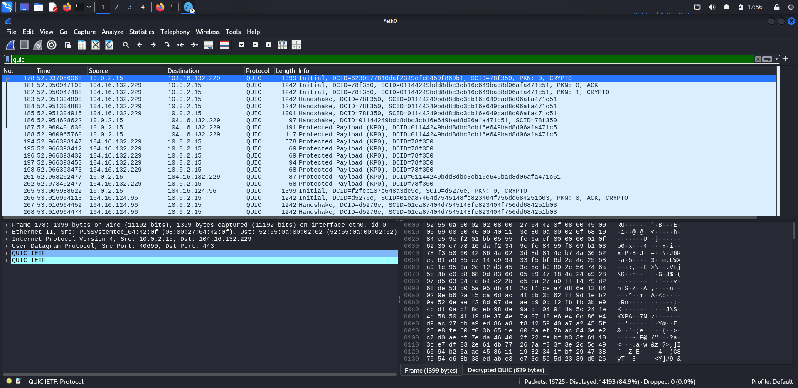
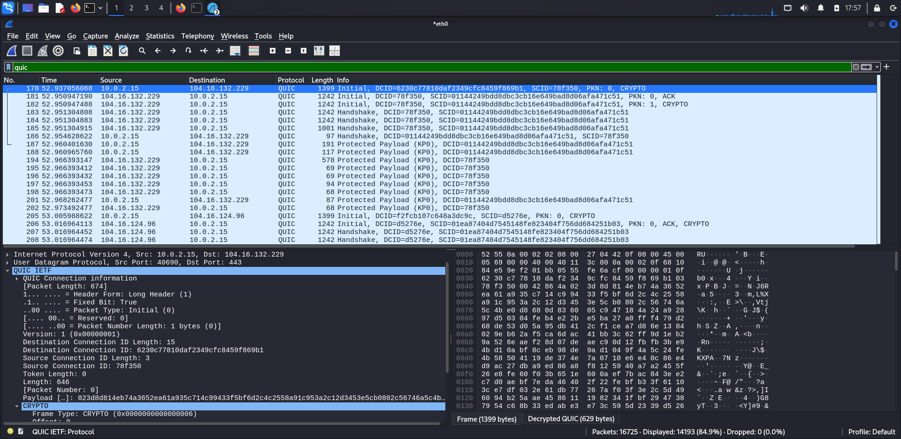
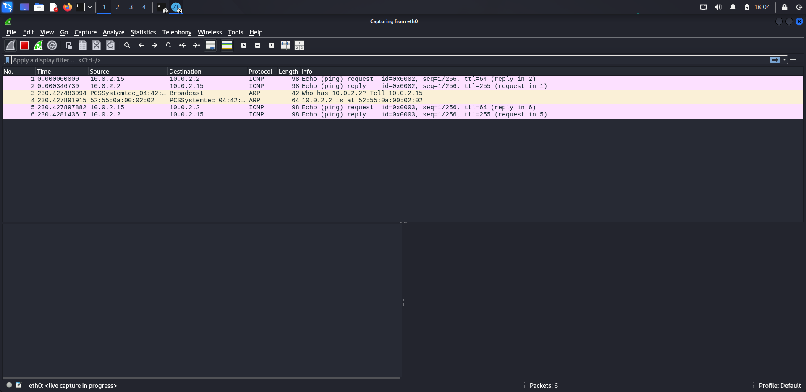
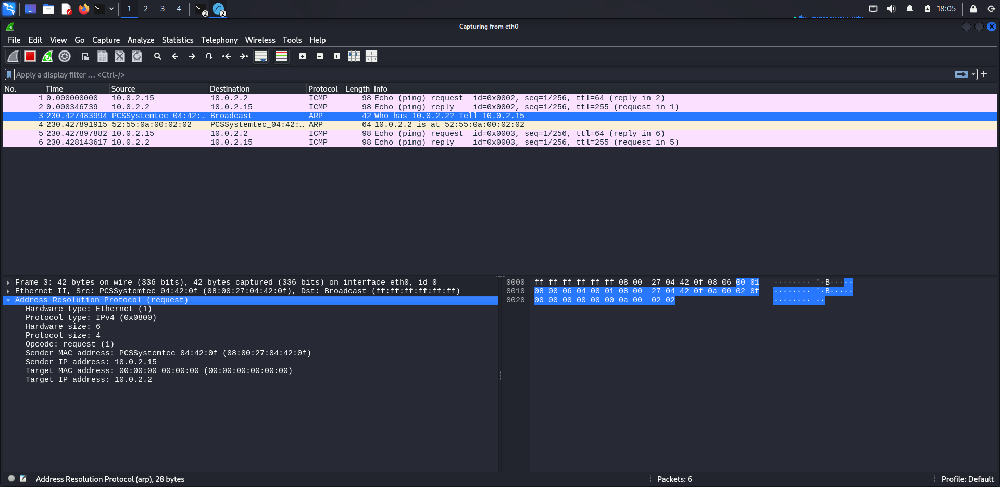

# Wireshark Network Traffic Analysis

## Overview

This project demonstrates practical network traffic analysis using Wireshark on Kali Linux. Live network traffic was captured and analyzed to understand how common network protocols communicate across a network.

The analysis includes DNS, TCP, TLS, QUIC, and ARP protocols along with Wireshark statistics such as Protocol Hierarchy, Conversations, Endpoints, I/O Graph, and Capture Summary.

---

## Objectives

- Capture live network traffic using Wireshark.
- Analyze common networking protocols.
- Understand packet structure and protocol behavior.
- Develop practical packet analysis skills.
- Document findings with screenshots and observations.

---

## Tools Used

- Wireshark 4.4.4
- Kali Linux 2025.1
- Oracle VirtualBox
- Mozilla Firefox

---

## Protocols Analyzed

- DNS
- TCP
- TLS
- QUIC
- ARP

---
---

## Project Structure

```
wireshark-network-traffic-analysis/
│
├── README.md
├── report/
│   └── Network_Traffic_Analysis_Report.pdf
└── screenshots/
    ├── 01-dns-query.png
    ├── 02-dns-response.png
    ├── 03-tcp-handshake.png
    ├── 04-tcp-details.png
    ├── 05-tls-handshake.png
    ├── 06-tls-client-hello.png
    ├── 07-quic-packets.png
    ├── 08-quic-details.png
    ├── 09-arp-packet-list.png
    ├── 10-arp-details.png
    ├── 11-io-graph.png
    ├── 12-capture-summary.png
    └── 13-protocol-hierarchy.png
```

---

## Tools Used

- Wireshark
- Kali Linux
- GitHub

---

## Protocols Analyzed

- DNS
- TCP
- TLS
- QUIC
- ARP

---

## Skills Demonstrated

- Network Traffic Analysis
- Packet Inspection
- Protocol Analysis
- Wireshark Filtering
- TCP Handshake Analysis
- DNS Resolution Analysis
- TLS Handshake Inspection
- QUIC Traffic Analysis
- ARP Packet Analysis
- Technical Documentation

---
---

# Network Protocol Analysis

## 1. DNS Analysis

### Observation
A DNS query was captured to resolve a domain name into an IP address.

### Findings
- Standard DNS Query
- Standard DNS Response
- Domain successfully resolved
- DNS operates over UDP port 53

**Screenshots**





---

## 2. TCP Analysis

### Observation
Captured the TCP three-way handshake before the HTTPS connection was established.

### Findings
- SYN packet sent by client
- SYN-ACK received from server
- ACK completed the connection
- Reliable connection established

**Screenshots**





---

## 3. TLS Analysis

### Observation
Captured the TLS handshake during HTTPS communication.

### Findings
- Client Hello
- Server Hello
- Cipher Suite Negotiation
- Encrypted communication established

**Screenshots**





---

## 4. QUIC Analysis

### Observation
Captured QUIC packets over UDP port 443.

### Findings
- QUIC Initial Packet
- Connection IDs observed
- Faster encrypted communication
- Reduced connection latency

**Screenshots**





---

## 5. ARP Analysis

### Observation
Captured ARP request and reply packets.

### Findings
- ARP Request
- ARP Reply
- MAC address resolution
- Local network communication

**Screenshots**





---

# Wireshark Statistics

The captured traffic was further analyzed using Wireshark's built-in statistical tools.

## Statistics Reviewed

- Protocol Hierarchy
- Conversations
- Endpoints
- I/O Graph
- Capture Summary

These statistics provided additional insight into protocol distribution, communication endpoints, packet flow, and overall network behavior during the capture session.

---

# Key Learning Outcomes

Through this project, I gained practical experience in:

- Capturing live network traffic using Wireshark
- Applying protocol filters for efficient packet analysis
- Understanding DNS name resolution
- Analyzing the TCP three-way handshake
- Inspecting TLS handshake messages and encrypted communication
- Examining QUIC traffic over UDP
- Understanding ARP request and reply operations
- Using Wireshark statistics to analyze network behavior
- Documenting packet analysis findings in a structured technical report

---

# Security Insights

The captured traffic demonstrates how modern network communication relies on multiple protocols working together.

Key observations include:

- DNS resolves domain names before communication begins.
- TCP establishes reliable connections before data transmission.
- TLS encrypts communication to protect confidentiality.
- QUIC improves performance by reducing connection setup time.
- ARP enables communication within the local network by resolving MAC addresses.

Understanding these protocols is essential for network troubleshooting, incident response, malware analysis, and security monitoring.

---

# Conclusion

This project demonstrates practical experience in capturing and analyzing live network traffic using Wireshark on Kali Linux.

The analysis covered multiple network protocols, including DNS, TCP, TLS, QUIC, and ARP, along with Wireshark statistical analysis. The project strengthened practical packet analysis skills, improved understanding of protocol behavior, and reinforced core cybersecurity concepts used in SOC operations, digital forensics, and network security.

---

## Repository Contents

- README Documentation
- Packet Analysis Report
- Annotated Screenshots
- Protocol Analysis
- Wireshark Statistics

---

## Future Improvements

- Analyze HTTP and HTTPS traffic in greater depth
- Perform malware traffic analysis
- Analyze suspicious PCAP files
- Investigate network attacks using Wireshark
- Expand the project with Zeek and Suricata analysis

---


## Author

**Amalraj M O**

Cybersecurity Graduate (2026)
